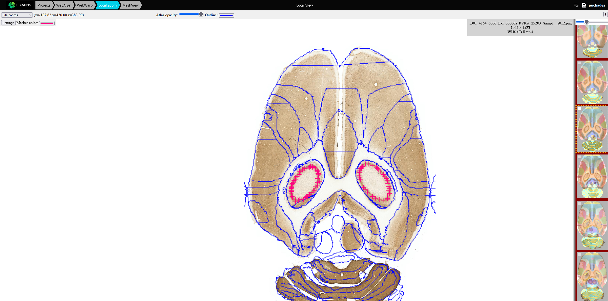

**LocaliZoom viewer and annotation tool**
--------------------------------------------

The same basic viewing controls applies and in addition extraction of a limited
number of coordinates, e.g. representing an electrode track or labelling
within a small region of interest is possible. Users can inspect the
images at cellular resolution and observe brain regions, names, and
boundaries and annotate points in order to extract coordinates.

Use the webapp here: https://localiview.apps.ebrains.eu/

Dataset DOI: https://doi.org/10.25493/G6CQ-D4D

**Controls**:

• Press Space to annotate points of interest. The color of the points can be changed by clicking on the "Settings button" and on the color. 
• Press Delete to remove an annotation marker under the mouse cursor

The points are saved automatically.

**Viewing point coordinates in MeshView**

The saved points can be visualised in the 3D viewer, MeshView (https://meshview-for-brain-atlases.readthedocs.io/en/latest/index.html) which is also available in the LocaliView workbench.

Read more about MeshView here: https://meshview-for-brain-atlases.readthedocs.io/en/latest/ 

