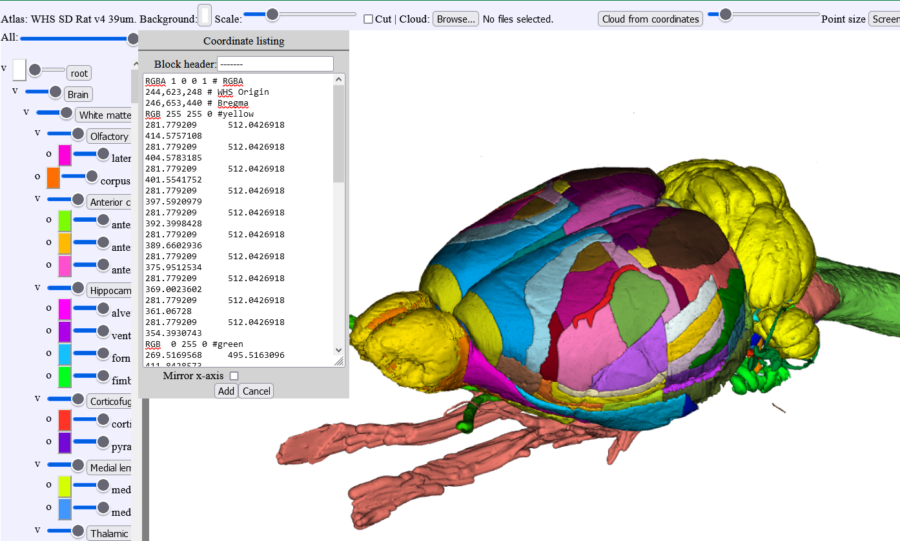
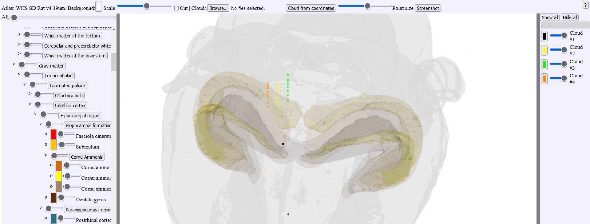

**LocaliZoom viewer and annotation tool**
--------------------------------------------

The same basic viewing controls applies and in addition extraction of a limited
number of coordinates, e.g. representing an electrode track or labelling
within a small region of interest is possible. Users can inspect the
images at cellular resolution and observe brain regions, names, and
boundaries and annotate points in order to extract coordinates.

Use the webapp here: https://wiki.ebrains.eu/bin/view/Collabs/image-registration-and-analysis-demo

.. image:: vertopal_f685c684f9f741c382a00fa63533872a/media/image4.png
   :width: 5.4in
   :height: 2.88611in

Dataset DOI: 10.25493/G6CQ-D4D

**Controls**:

• Press Space to annotate points of interest. Atlas coordinates for points of interest can be exported to Excel or MeshView atlas viewer 
• Press Delete to remove an annotation marker under the mouse cursor
 
To extract a coordinate, the mouse marker must be positioned at the desired location, and press the space bar. A cross will appear in the selected colour (under Settings), representing the location of the extracted coordinate. After all desired points have been marked, the coordinates can be exported to Excel.

Press "delete" in order to remove an annotation.

Save your annotations with the "save" or "save as" buttons. The file format is .lz

**Export to Excel**

The markers will be listed 1,2,3,4, etc.. in the order you place them. In the example below, electrode tracks were mapped. In order to keep track of which marker belong to which electrode, you can assign a different color to each electrode and start placing the markers on your images in a systematic way e.g. (marker 1: yellow; marker 2:green, etc...).
The coordinates for each markers are found under fx, fy, fz. Those coordinates can be copied and arranged in a notepad file as shown in the figure where you can assign a RGB code to the marker list.
This notepad file can be pasted in MeshView for you to visualise your electrode tracks.

.. image:: vertopal_f685c684f9f741c382a00fa63533872a/media/image5.png
   :width: 6.3139in
   :height: 2.59306in

**Viewing point coordinates in MeshView**

The saved .lz file can also be visualised in the 3D viewer, MeshView (https://meshview-for-brain-atlases.readthedocs.io/en/latest/index.html) which is also available as a webapp in the EBRAINS collaboratory.

Read more about MeshView here: https://meshview-for-brain-atlases.readthedocs.io/en/latest/ 

