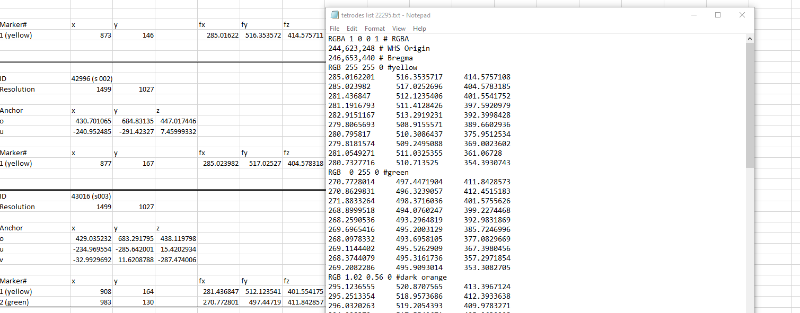

**Localizoom viewer and annotation tool**
--------------------------------------------

The same basic controls applies and in addition extraction of a limited
number of coordinates, e.g. representing an electrode track or labelling
within a small region of interest is possible. Users can inspect the
images at cellular resolution and observe brain regions, names, and
boundaries and annotate points in order to extract coordinates.

.. image:: vertopal_f685c684f9f741c382a00fa63533872a/media/image4.png
   :width: 6.3in
   :height: 2.88611in

In order to activate the annotation mode, press on **“annotation tools”**
button (8), new button s will appear. To extract a coordinate, the mouse
marker must be positioned at the desired location, and space must be
pressed. **A cross will appear in the selected colour** (9), representing
the location of the extracted coordinate. After all desired points have
been marked, the coordinates can be exported either to **Excel** (10) or to
**MeshView** (11) using the corresponding buttons in the upper toolbar.

When clickingthese buttons, a set of coordinates will appear that can be
copy pasted into MeshView in order to work with these point clouds in
3D.

**Export to Excel**

**Export to MeshView**

**Controls**:
