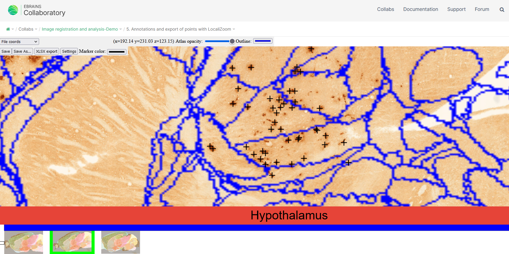

**LocaliZoom viewer and annotation tool**
--------------------------------------------

The same basic viewing controls applies and in addition extraction of a limited
number of coordinates, e.g. representing an electrode track or labelling
within a small region of interest is possible. Users can inspect the
images at cellular resolution and observe brain regions, names, and
boundaries and annotate points in order to extract coordinates.

To extract a coordinate, the mouse marker must be positioned at the desired location, and press the space bar. A cross will appear in the selected colour (under Settings), representing the location of the extracted coordinate. After all desired points have been marked, the coordinates can be exported either to Excel.

Press "delete" in order to remove an annotation.

Save your annotations with the "save" or "save as" buttons. The file format is .lz

**Export to Excel**

.. image:: vertopal_f685c684f9f741c382a00fa63533872a/media/image5.png
   :width: 6.30139in
   :height: 2.59306in

**Viewing point coordinates in MeshView**

The saved .lz file can also be visualised in the 3D viewer, MeshView.

**Controls**:

• Press Space to annotate points of interest. Atlas coordinates for points of interest can be exported to Excel or MeshView atlas viewer 
• Press Delete to remove an annotation marker under the mouse cursor
 
