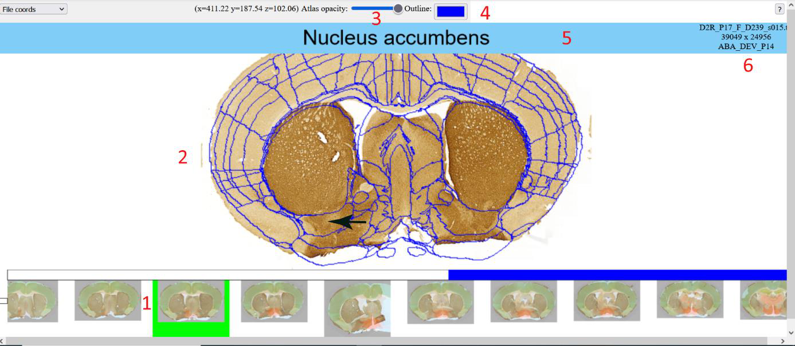
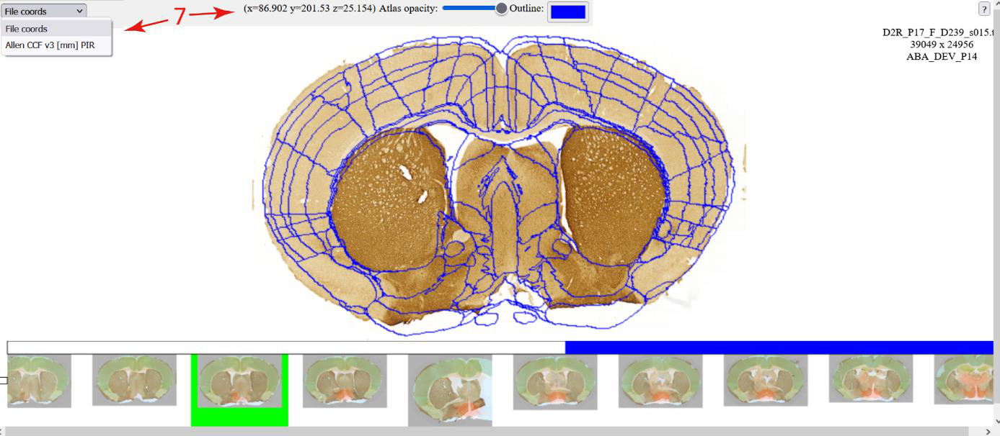

**LocaliZoom viewer service in dataset cards**
-------------------------------
These links can be found in certain EBRAINS datasets like e.g. Cullity et al. (2021). Distribution of dopamine 2 receptor positive neurons in the juvenile female mouse brain (v1) [Data set]. EBRAINS. https://doi.org/10.25493/G5VR-63E

By clicking on the viewer link at the bottom of the dataset card, you can open the image series in LocaliZoom.

**Basic operations**

In LocaliZoom viewer, serial section images (1) are represented in a
filmstrip at the bottom of the webpage user interface, with the selected
section image shown with an atlas overlay (2) in the main view.

In the upper panel, users can adjust the transparency of the atlas
overlay (3) allowing them to see the experimental image and the atlas
regions simultaneously. The outline appears when minimum transparency is
selected. It is possible to change the colour of the outline (4) and see
the name of the image file (6).

In the middle panel, the pointer of the mouse will show the atlas region
name (5). The main image can be zoomed and panned.

**Controls**:

• Pan and zoom with mouse drag and mouse scroll wheel            
• Step backwards and forwards in series with left and right arrow keys                                                      
• Quick set segmentation transparency to minimum and back using down and up arrow keys                                          
• Drag an annotation marker to refine its position                

**Coordinates of points**

The user can visualise the coordinates of the mouse pointer (7) and
switch between different coordinate spaces when available.

