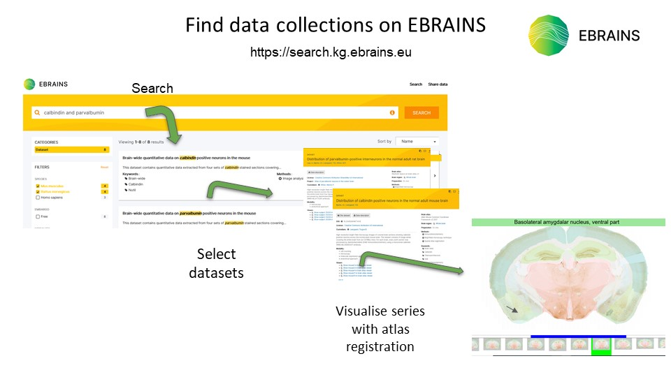
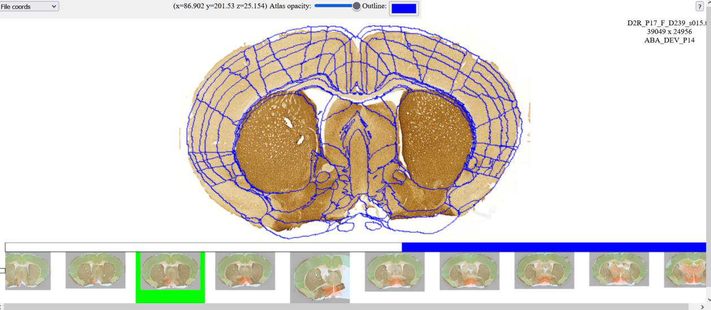

**What is LocaliZoom?**
------------------- 
EBRAINS LocaliZoom serial section image viewer provides an intuitive way
of navigating high-resolution 2D image series coupled with segmentation
overlay, from a web browser. At its core, it is a web-based pan-and-zoom
2D image viewer coupled with a volumetric atlas slicer, and a
navigational aid showing the entire image series as a "filmstrip".
Building on the open standard Deep Zoom Image (DZI) format, it is able
to efficiently visualise very large brain images in the gigapixel range,
allowing to zoom from common, display-sized overview resolutions down to
the microscopic resolution without downloading the underlying very large
image dataset.

In addition, LocaliZoom is available as a web app in the EBRAINS workflow LocaliView.
The LocaliView workflow is accessible with an EBRAINS account.

    https://localiview.apps.ebrains.eu/

*Key features*:
  - Visualisation of experimental histological section images with atlas overlay 
  - Display of the atlas region name when pointing the mouse at the region of interest
  - Annotations and extraction of coordinate points when enabled
  

Dataset DOI: https://doi.org/10.25493/G5VR-63E     

